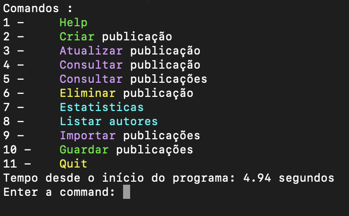
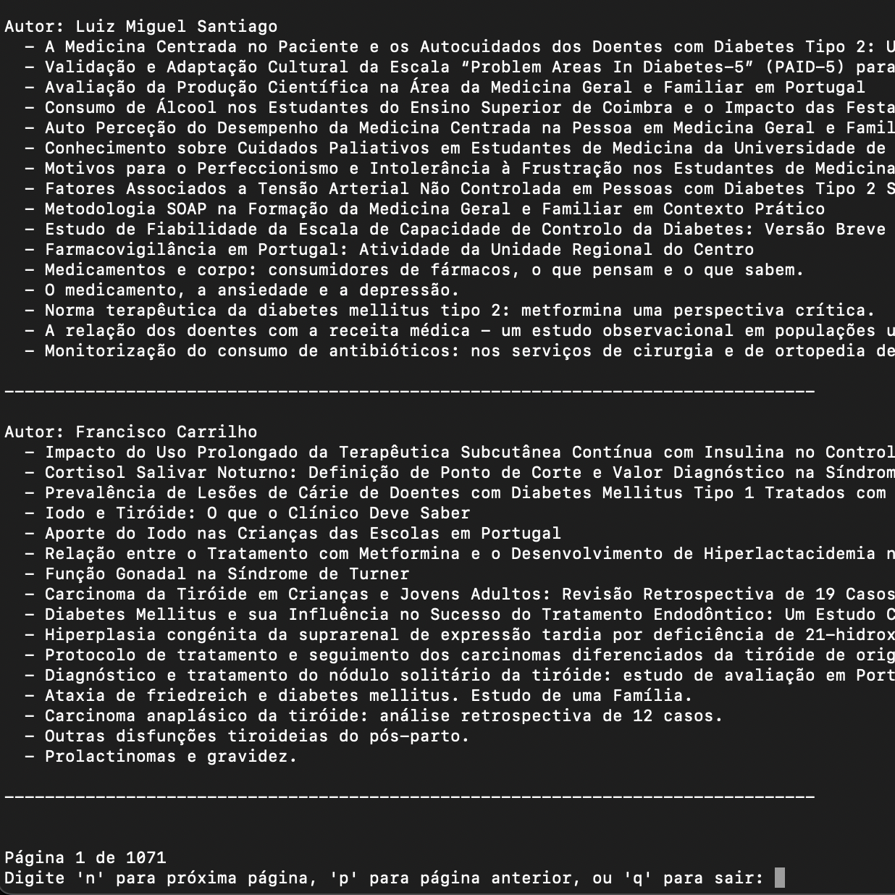
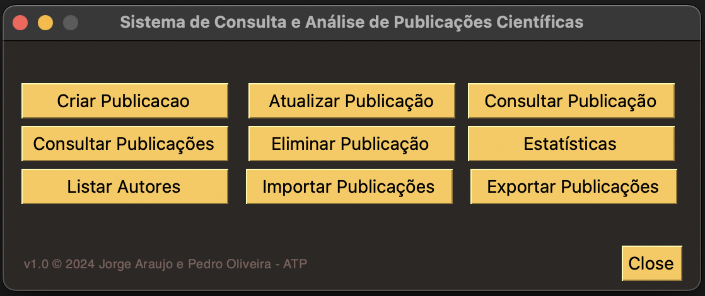

# Projeto Final  
**Algoritmos e Técnicas de Programação**  
Ano Letivo 2024/2025  

**Grupo:**   
- Jorge Araújo A98685 

**Docentes:**  
- José Carlos Ramalho  
- Luís Filipe Cunha  

Braga, 5 de janeiro de 2025  

---

## Resumo  
Este relatório foi elaborado no contexto da unidade curricular de Algoritmos e Técnicas de Programação da Universidade do Minho, com o objetivo de desenvolver um sistema de Consulta e Análise de Publicações Científicas com o uso de Python. O principal objetivo deste projeto é criar uma ferramenta simples, intuitiva e eficiente, que permita aos usuários visualizar e manipular publicações científicas de forma acessível e prática. Essa abordagem está alinhada com os objetivos da disciplina, ao proporcionar a aplicação de técnicas de programação para resolver problemas do mundo real e facilitar o acesso a informações acadêmicas relevantes.

---

## 1. Introdução  
No projeto final da Unidade Curricular de Algoritmos e Técnicas de Programação, foi proposta a criação de uma aplicação para consulta e análise de publicações científicas, com base num dataset de publicações. Este projeto teve como objetivo aplicar os conhecimentos adquiridos ao longo do semestre, com destaque para a manipulação de dados por meio de estruturas como listas, ficheiros, tuplos e dicionários.

Ao longo deste relatório, iremos explicar os passos seguidos para a criação e implementação da aplicação. 

## Estrutura do Projeto

### Ficheiros do Projeto
A estrutura do projeto é composta pelos seguintes ficheiros, organizados para separar as responsabilidades de cada componente do sistema:
1. **`operacoes_autor.py`**:
Este ficheiro é dedicado às operações dos autores. Contém as seguintes funcionalidades:
- **Adição e remoção de publicações associadas aos autores**
- Listagem de autores ordenados pelo número de publicações, com paginação
- Manuntenção da estrutura interna para relacionar autores às suas publicações, o que facilitou as consultas e atualizações. 
2. **`operacoes_publicacao.py`**:
Este ficheiro é responsável pelas operações relacionadas às publicações:
- **criação e atualização de publicações** 
- **consulta e eliminação de publicações** 
- **gestão de estatísticas** 
3. **`operações_json.py`**: 
O ficheiro contém as operações relacionadas com a manipulação de dados no formato JSON, mais especificamente o **carregamento** e **exportação** de dados. 
4. **`main.py`**: 
Este ficheiro é o mais importante pois é onde se encontram as operações CRUD do sistema e se unem as funcionalidades previamente criadas (Criação, atualização consulta e eliminação de publicações). Para além disso, contém as estatísticas pedidas na elaboração do projeto e funções adicionais, com o uso da biblioteca `OS` (para garantir compatibilidade da aplicação em diferentes sistemas operacionais) e `time`para saber o tempo ocorrido para cada execução de comandos.
5. **`interface_grafica.py`**: 
Interface gráfica implementada com o uso da biblioteca `PySimpleGUI`. Foi feita para ser intuitiva. Implementa as operações CRUD para a database e operações estatísticas através de janelas iterativas. É importante destacar que esta interface é completamente independente do ficheiro main.py, levando a que fosse necessário este tambêm unificar as funcionalidades dos outros ficheiros previamente mencionados.

### Descrição dos Componentes
- **Interface de Consola (CLI)** :

Esta interface permite que todas as funcionalidades do programa sejam acedidas. Aqui podemos observar o menu principal:\
\
Para aceder as funcionalidades deste menu é possível tanto escrever o nome da opção, como o respetivo número indicado.
É possível tambêm observar o tempo que o programa demorou a carregar o ficheiro `JSON` inicial.
Para certas funcionalidades foi aplicada paginação, como podemos observar pela seguinte imagem:\
\
Foi escolhida esta técnica, pois era a forma mais clara e acessível de representar os vários elementos armazenados no programa.

- **Interface Gráfica:** :
Para a interface gráfica foi utilizada a seguinte estrutura para o menu inícial :\
\
Ao selecionar um dos botões presentes, é apresentada uma nova janela, dependendo da opção.
---

## Implementação do Sistema

### Requesitos 

Foi nos pedido que implementasse-mos os seguintes requisitos funcionais :

#### 1. Carregamento da Base de Dados
- O programa deve carregar para memória o dataset guardado no ficheiro de suporte à aplicação no arranque.

#### 2. Criação de Publicações
- O utilizador deve poder criar um artigo especificando:
  - Título
  - Resumo
  - Palavras-chave
  - DOI
  - Lista de autores e afiliação correspondente
  - URL para o ficheiro PDF do artigo
  - Data de publicação
  - URL do artigo

#### 3. Atualização de Publicações
- O sistema deve permitir a atualização da informação de uma publicação, incluindo:
  - Data de publicação
  - Resumo
  - Palavras-chave
  - Autores e afiliações

#### 4. Consulta de Publicações
- O sistema deve permitir pesquisar publicações, com filtros por:
  - Título
  - Autor
  - Afiliação
  - Data de publicação
  - Palavras-chave
- Deve ser possível ordenar as publicações encontradas por:
  - Títulos
  - Data de publicação

#### 5. Análise de Publicações por Autor
- O sistema deve permitir listar os autores e aceder aos artigos de cada autor da lista.
- Os autores devem ser ordenados por:
  - Frequência dos artigos publicados
  - Ordem alfabética

#### 6. Análise de Publicações por Palavras-chave
- O sistema deve permitir a pesquisa e visualização das palavras-chave do dataset.
- As palavras-chave devem ser ordenadas por:
  - Número de ocorrências nos artigos
  - Ordem alfabética
- O sistema deve permitir visualizar a lista das publicações associadas a cada palavra-chave.

#### 7. Estatísticas de Publicação
O sistema deve apresentar relatórios com gráficos para:
- Distribuição de publicações por ano.
- Distribuição de publicações por mês de um determinado ano.
- Número de publicações por autor (top 20 autores).
- Distribuição de publicações de um autor por anos.
- Distribuição de palavras-chave pela sua frequência (top 20 palavras-chave).
- Distribuição de palavras-chave mais frequentes por ano.

#### 8. Armazenamento dos Dados
- Quando o utilizador decidir sair da aplicação ou selecionar o armazenamento dos dados, a aplicação deve guardar os dados em memória no ficheiro de suporte.

#### 9. Importação de Dados
- O sistema deve permitir importar novos registos de um ficheiro com a mesma estrutura do ficheiro de suporte.

#### 10. Exportação Parcial de Dados
- O sistema deve permitir exportar para ficheiro os registos resultantes de uma pesquisa (apenas o subconjunto retornado pela pesquisa).

### Requisitos Técnicos

#### 1. Linguagem
- O sistema deve ser implementado em Python.

#### 2. Estruturas de Dados
- Use estruturas de dados apropriadas, como:
  - Dicionários
  - Listas
  - Listas de dicionários

#### 3. Interfaces
O sistema deve ter duas interfaces de interação:
- **Interface de Linha de Comando (CLI)**
- **Interface Gráfica**

#### 4. Bibliotecas Python
- Use bibliotecas Python relevantes para funcionalidades como gráficos, por exemplo:
  - `matplotlib` para gráficos

#### 5. Mecanismo de Armazenamento Persistente
- Implemente um mecanismo de armazenamento persistente para guardar as publicações, por exemplo:
  - Ficheiro JSON

### Requisitos da Linha de Comando (CLI)

Na interface de linha de comando, o utilizador deve poder executar as seguintes operações:

#### 1. Help
- Imprimir uma mensagem de ajuda com os comandos disponíveis.

#### 2. Criar Publicação
- Permitir a criação de uma publicação com as informações fornecidas.

#### 3. Consultar Publicação
- Consultar a informação detalhada de uma publicação a partir de um identificador único.

#### 4. Consultar Publicações
- Listar as publicações presentes no sistema, permitindo filtros por:
  - Título
  - Autor
  - Afiliação
  - Palavras-chave
  - Data de publicação

#### 5. Eliminar Publicação
- Eliminar uma publicação a partir de um identificador único.

Considerando os requisitos anteriormente referidos, existiu alguns que causaram mais dificuldade que outros. Nomeadamente, os requisitos de estatísticas, consultar publicações com filtros e a análise de palavras-chave levaram-nos a pensar formas corretas de guardar em estruturas de dados a informação necessária para poder atender a estes pedidos. Para além de ter que criar as estruturas de dados, estes requisitos também nos fizeram pensar como recolher a informação pertinente do dataset introduzido.

---

## Estrutura de Dados
- Os dados entram no sistema via input ou ficheiros JSON, e são manipulados em memória para realizar operações como criar, atualizar, consultar e finalmente são armazenados em ficheiros `JSON` para garantir a persistência. A organização modular do código garante que cada operação é realizada de forma eficiente, o que mantém os dados consistentes e acessíveis.
---

## Desafios e Soluções
- Um desafio que infelizmente não conseguimos resolver, foi na apresentação de gráficos de estatísticas na interface gráfica, em sistemas MacOs e Linux. Após fechar a janela do gráfico ocorre um `segmentation fault` e o programa fecha. Descobrimos que o problema deriva da biblioteca `matplotlib`. Embora os desenvolvidores do `PySimpleGUI` estejam a par desse problema, não é algo que conseguiram resolver. [1]
- Outro desafio menos exigente foi que identificador único utilizar para as publicações, já que estas não possuem nenhum como campo. Para tal, decidimos utilizar os ultimos digitos do url, pois identificamos que são diferentes para todas as publicações. 
- Uma das soluções mais interessantes a apontar foi a solução pensada para um problema com que nos estávamos a deparar. Ao tentar representar as estatísticas de palavras-chave mais frequentes por ano, o gráfico gerado continha demasiádas palavras-chave, o que o tornava inelígivel. Assim, a solução a que chegamos foi pedir ao utilizador um número máximo de palavras a representar nesse gráfico.
quando usas criar publicacao na interface mesmo ao adicioanr os autores eles n aparecem na publicacao criada 
---

## Conclusão

Em suma, a aplicação apresentada foi concluída com sucesso, demonstrando estar à altura dos desafios propostos, tanto pelo problema como pela Unidade Curricular. 

Apesar das dificuldades encontradas ao longo do desenvolvimento, conseguimos criar uma aplicação funcional, que corresponde ao que inicialmente planeámos e idealizámos. Para alcançar este objetivo, utilizámos todas as ferramentas e conhecimentos adquiridos nesta Unidade Curricular, desde a manipulação de dados ao desenvolvimento de interfaces. Adicionalmente, recorremos à internet como um recurso complementar para aprofundar o conhecimento aprendido.

Em conclusão, este projeto permitiu-nos desenvolver competências importantes, nomeadamente na leitura e no processamento de bases de dados em formato JSON.

---

## Referências
- [1]-https://github.com/PySimpleGUI/PySimpleGUI/issues/6006
